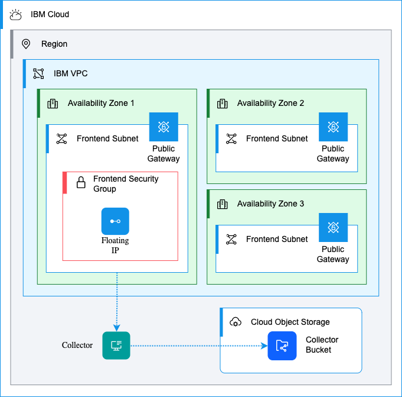
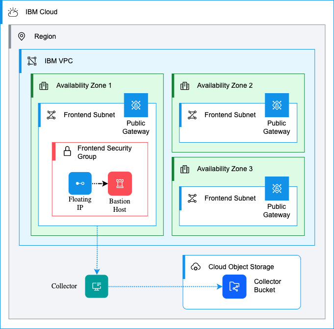
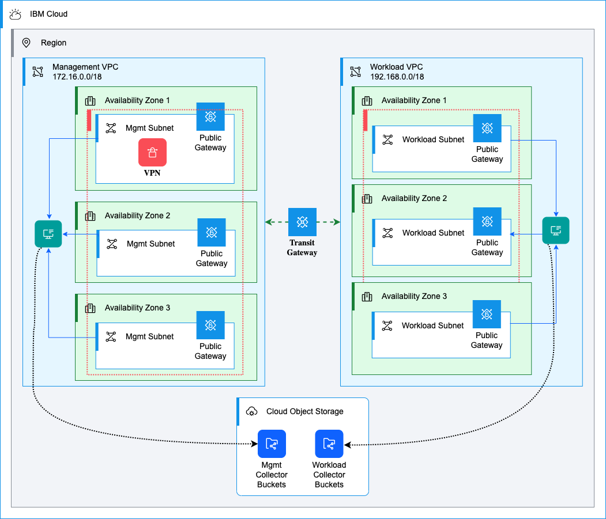

# IBM Cloud VPC MZR Template

This repository contains a template for creating a new IBM Cloud MZR VPC. It is intended to be used as a starting point for new projects.

## Versions

There are currently three versions of this template based on branch:

### Base Deployment (base branch) 

Contains a single MZR VPC with a public gateway, subnet, security group and flowlogs collector.

### Bastion Deployment (bastion branch)

Contains a single MZR VPC with a public gateway, subnet, security group, flowlogs collector and a bastion host.

### Landing Zone Deployment (landing-zone branch)

> Major WIP: This branch is currently a work in progress and is not yet ready for use.

Contains 2 MZR VPCs (workload and management) with public gateways, subnets, security groups, a flowlogs collector and a bastion host. The 2 VPCs are connected using a [Transit Gateway](https://cloud.ibm.com/docs/transit-gateway?topic=transit-gateway-about).

## Resources

| Name | Type | Branch | Description |
|------|------|------|------|
| Resource Group | [ibm_resource_group](https://registry.terraform.io/providers/IBM-Cloud/ibm/latestdocs/resources/resource_group) | `all` branches | Resource group for all deployed resources. If an existing Resource Group is not specified, a new one will be created. |
| Workload VPC | [ibm_is_vpc](https://registry.terraform.io/providers/IBM-Cloud/ibm/latest/docs/resources/is_vpc) | `all` branches | Workload VPC with address prefixes, public gateways, and subnets in each regional zone. |
| Management VPC | [ibm_is_vpc](https://registry.terraform.io/providers/IBM-Cloud/ibm/latest/docs/resources/is_vpc) | `landing-zone` only | Management VPC with address prefixes, public gateways, and subnets in each regional zone. |
| Frontend Security Group | [ibm_is_security_group](https://registry.terraform.io/providers/IBM-Cloud/ibm/latest/docs/resources/is_security_group) | `all` branches | Frontend Security group allowing `tcp/80`, `tcp/443`, `tcp/22` and `icmp` inbound and `dns udp/53` outbound. |
| Bastion Host | [ibm_is_instance](https://registry.terraform.io/providers/IBM-Cloud/ibm/latest/docs/resources/is_instance) | `bastion` only | An IBM Cloud compute host to act as a Bastion for the VPC. |
| VPC SSH Key | [ibm_is_ssh_key](https://registry.terraform.io/providers/IBM-Cloud/ibm/latest/docs/resources/is_ssh_key) | `all` branches | An SSH key that will be added to the region and any deployed hosts. If an existing key is not specified, a new one will be created. |
| VPC Flowlogs Collector | [ibm_is_flow_log_collector](https://registry.terraform.io/providers/IBM-Cloud/ibm/latest/docs/resources/is_flow_log_collector) | `all` branches | VPC Flow Logs Collector for subnets in each zone. |
| Cloud Object Storage  | [ibm_resource_instance](https://registry.terraform.io/providers/IBM-Cloud/ibm/latest/docs/resources/resource_instance) | `all` branches | Cloud Object Storage instance. If an existing instance is not specified, a new one will be created. |
| Cloud Object Storage Bucket  | [ibm_cos_bucket](https://registry.terraform.io/providers/IBM-Cloud/ibm/latest/docs/resources/cos_bucket) | `all` branches | Cloud Object Storage bucket for Flow Logs. |
| IAM Service Authorization | [ibm_iam_authorization_policy](https://registry.terraform.io/providers/IBM-Cloud/ibm/latest/docs/resources/iam_authorization_policy) | `all` branches | IAM Service Authorization for the VPC Flow Logs Collector to write to Object Storage instance. |
| VPC VPN Gateway | [ibm_is_vpn_gateway](https://registry.terraform.io/providers/IBM-Cloud/ibm/latest/docs/resources/is_vpn_gateway) | `landing-zone` only | Site-to-Site VPN Gateway. |
| Transit Gateway | [ibm_is_vpn_gateway](https://registry.terraform.io/providers/IBM-Cloud/ibm/latest/docs/resources/is_vpn_gateway) | `landing-zone` only | Transit Gateway to interconnect the workload and management VPCs. |

## Usage

See [Wiki](https://github.com/cloud-design-dev/ibmcloud-mzr-vpc-template/wiki) for usage instructions.
